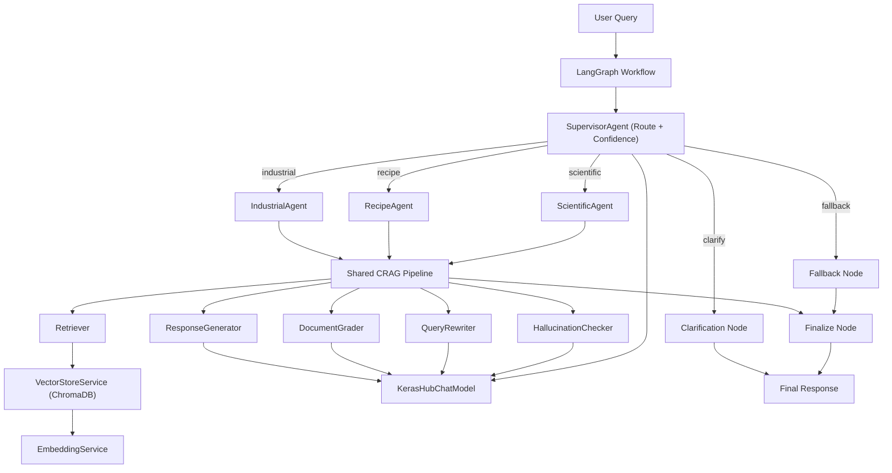

# AI574 Architecture Write-Up

## 1. System Overview

AI574 is a multi-domain assistant that combines:
- A **supervisor/router** for intent classification
- Three **domain specialists** (`industrial`, `recipe`, `scientific`)
- A shared **Corrective RAG (CRAG)** execution pipeline
- A **LangGraph state machine** for deterministic orchestration

Primary objective:
- Route each user query to the right domain and answer with grounded, source-backed output.

Primary domains:
- Industrial troubleshooting (PLC/SCADA/fault diagnostics)
- Recipe guidance and substitutions
- Scientific literature summarization with ArXiv support

## 2. Architectural Style

The project uses a layered, modular architecture:

- **Configuration layer**: `config/`
- **Foundation layer**: model wrappers, embeddings, vector DB (`foundation/`)
- **Ingestion layer**: document loading/chunking/indexing (`ingestion/`)
- **Retrieval and reasoning layer**: CRAG pipeline (`rag_core/`)
- **Domain behavior layer**: specialist agents (`agents/`)
- **Orchestration layer**: routing + workflow graph (`orchestration/`)
- **Evaluation layer**: metrics and verification (`evaluation/`)

This is a pragmatic hybrid of:
- **Pipeline architecture** (ingest -> chunk -> index -> retrieve -> generate)
- **State-machine orchestration** (LangGraph workflow)
- **Strategy/polymorphism** for domain-specific handling (`BaseAgent` subclasses)

## 3. High-Level Component Diagram

## 4. Runtime Flow (End-to-End)

1. A query enters `run_query(...)` in `orchestration/workflow_graph.py`.
2. `SupervisorAgent.route(...)` classifies intent to one target:
   - `industrial`, `recipe`, `scientific`, `clarify`, or `fallback`.
3. For domain routes, the selected agent executes:
   - optional domain-specific query preprocessing
   - shared `CRAGPipeline.run(...)`
   - optional domain-specific response postprocessing
4. CRAG execution:
   - Retrieve top-k docs from domain collection
   - Grade relevance using LLM-as-judge
   - If insufficient context, rewrite query and retry
   - Generate response from selected context
   - Validate grounding via hallucination checker
5. `finalize_node` returns final response and metadata (sources/confidence/status/timing).

## 5. Key Modules and Responsibilities

### 5.1 Orchestration
- `orchestration/supervisor.py`
  - Produces domain + confidence + reasoning JSON
  - Includes low-confidence clarification behavior
  - Has backup prompt path and fallback route
- `orchestration/workflow_graph.py`
  - Builds executable LangGraph
  - Dynamically loads agent classes via config registry
  - Captures timing fields in shared state

### 5.2 Domain Agents
- `agents/base_agent.py`: common handle contract
- `agents/industrial_agent.py`: fault-code emphasis + safety warning postprocessing
- `agents/recipe_agent.py`: substitution/technique expansion + dietary tags
- `agents/scientific_agent.py`: optional on-demand ArXiv indexing retry

### 5.3 CRAG Core
- `rag_core/retriever.py`: domain-scoped retrieval wrapper
- `rag_core/document_grader.py`: relevance grading, batch + fallback logic
- `rag_core/query_rewriter.py`: rewrite failed retrieval queries
- `rag_core/response_generator.py`: prompt-conditioned generation + source extraction
- `rag_core/hallucination_checker.py`: grounding check + escalation signal
- `rag_core/crag_pipeline.py`: orchestration and retry policy

### 5.4 Foundation
- `foundation/llm_wrapper.py`: KerasHub model bridge to LangChain `BaseChatModel`
- `foundation/embedding_service.py`: sentence-transformers embedding adapter
- `foundation/vector_store.py`: ChromaDB abstraction and domain collection isolation

### 5.5 Ingestion
- `ingestion/document_loader.py`: PDF/text/CSV/ArXiv loaders
- `ingestion/chunking_pipeline.py`: chunking + industrial preprocessing
- `ingestion/index_builder.py`: domain indexing orchestration

### 5.6 Evaluation
- `evaluation/metrics.py`: routing accuracy, reliability checks, latency snapshots
- `tests/test_crag_pipeline.py`: unit tests with mocks for CRAG edge cases

## 6. State and Data Model

Shared runtime state is captured by `AgentState` (`orchestration/state_schema.py`) and includes:
- User input and history
- Routing decision/confidence
- Agent outputs and source list
- Escalation/clarification flags
- Timing breakdowns

Vector-store document metadata consistently carries:
- `source`, `id`, `parent_id`, `chunk_index`, `domain`, and similarity score

This metadata strategy enables source attribution and debugging across the pipeline.

## 7. Existing Strengths

- Clean separation of concerns across layers
- Config-driven domain registry and prompt mapping
- Shared CRAG pipeline reused by all domain agents
- Robustness features:
  - rewrite-and-retry retrieval loop
  - JSON parsing fallback logic
  - confidence clamping and clarification thresholding
- Testable design with mocks around LLM/vector store

## 8. Architectural Risks and Gaps

- No canonical app runtime entrypoint (only notebook/demo-style execution)
- Fallback path is static text (no integrated real search tool)
- Dependency drift risk (core code imports modules not locked in `requirements.txt`)
- Limited integration/e2e tests across full workflow boundaries
- Observability is logging-centric; no structured metrics/tracing backend
- Prompt-injection and retrieval poisoning defenses are minimal

## 9. Recommendations for Improvement

### Priority P0 (High Impact, Near-Term)

1. Add a production entrypoint (`CLI` and/or minimal API service).
   - Why: Improves reproducibility and deployment readiness.
   - Change:
     - Add `main.py` (or `app.py`) to initialize models, index builder, workflow.
     - Accept query input and print structured output.
     - Optionally expose FastAPI endpoint for `run_query`.

2. Fix dependency contract and lock environment.
   - Why: Prevents setup failures and “works in notebook only” drift.
   - Change:
     - Add missing direct dependencies to `requirements.txt`:
       - `langchain-text-splitters`
       - `transformers`
     - Add pinned/validated Python version and install docs for CPU/GPU variants.

3. Implement real fallback tool path.
   - Why: Current `fallback` route does not fulfill out-of-domain queries.
   - Change:
     - Replace static message in `_make_fallback_node` with optional web-search adapter.
     - Gate by config and return cited snippets.

### Priority P1 (Scalability and Reliability)

4. Introduce structured observability.
   - Why: Timing is captured but not aggregated or query-correlated.
   - Change:
     - Add request IDs into `AgentState`.
     - Emit structured JSON logs for each node.
     - Export counters/histograms (routing confidence, escalation rate, per-step latency).

5. Strengthen evaluation and regression automation.
   - Why: Current tests are strong at unit level but weak on full-path regressions.
   - Change:
     - Add integration tests that run `build_workflow -> run_query` with lightweight fake LLMs.
     - Add snapshot tests for routing and source attribution schema.
     - Add CI checks for tests + lint + import integrity.

6. Harden retrieval quality and trust boundaries.
   - Why: System assumes retrieved context is trustworthy and prompt-safe.
   - Change:
     - Add document sanitization/redaction hooks pre-index.
     - Add retrieval-time metadata filters and source allowlists.
     - Add prompt-injection detection in retrieved chunks before generation.

### Priority P2 (Design and Developer Experience)

7. Add domain plugin contract for easier extension.
   - Why: New domains currently require touching multiple files manually.
   - Change:
     - Define explicit domain plugin interface (agent + prompt + collection + ingest recipe).
     - Validate registry at startup and fail fast on misconfiguration.

8. Introduce typed schemas for all model I/O JSON contracts.
   - Why: Current dict-based parsing is flexible but less strict.
   - Change:
     - Add Pydantic models for routing, grading, hallucination-check results.
     - Centralize parsing/validation utilities.

9. Improve indexing lifecycle management.
   - Why: No explicit dataset versioning or index refresh policies.
   - Change:
     - Add index manifest metadata (domain/source/version/timestamp).
     - Add incremental indexing and reindex commands.

### Priority P3 (Performance)

10. Optimize CRAG latency and throughput.
   - Why: Multiple LLM calls per request can be expensive.
   - Change:
     - Add optional adaptive mode: skip hallucination check above high-confidence threshold.
     - Cache grader/checker responses for repeated query-doc sets.
     - Parallelize retrieval + lightweight prechecks where safe.

## 10. Suggested 30-Day Roadmap

Week 1:
- P0 #1 and #2 (entrypoint + dependency hardening)

Week 2:
- P0 #3 (real fallback integration) + P1 #4 (structured logging base)

Week 3:
- P1 #5 and #6 (integration tests + trust hardening)

Week 4:
- P2 #7/#8 plus selected P3 optimizations after baseline metrics

## 11. Summary

The existing architecture is modular and technically solid for a research/academic multi-agent CRAG system.  
The highest-leverage improvements are operationalization (entrypoint + dependency hygiene), stronger fallback/reliability behavior, and production-grade observability/testing.
