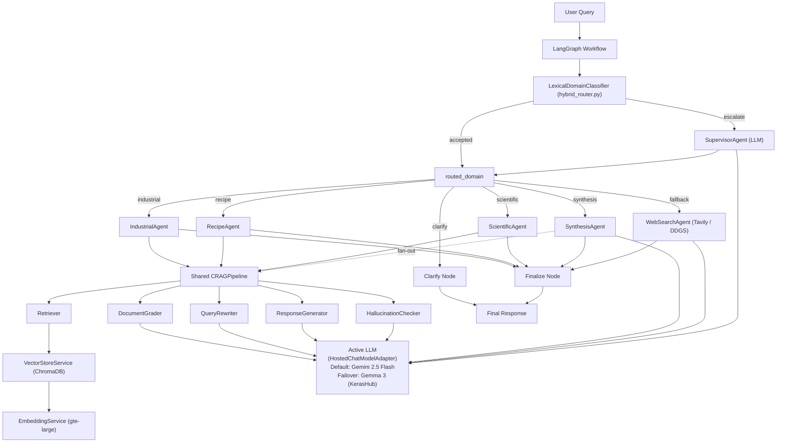

# AI574 Architecture Overview

_Last updated: 2026-04-25 — describes the system as wired in `orchestration/workflow_graph.build_workflow`._

## 1. System Overview

AI574 is a multi-domain question-answering system built on a Corrective RAG (CRAG) backbone, a LangGraph state machine, and a two-tier router that decides which specialist domain (or combination of domains) should answer a given query. The objective is to take an arbitrary natural-language question, send it through the cheapest competent reasoning path that can ground an answer, and return a response with explicit source attribution and confidence metadata.

The system supports five distinct response paths:

- **`industrial`** — PLC / SCADA / fault-code / drives / motor troubleshooting
- **`recipe`** — cooking, ingredient substitution, dietary adaptation
- **`scientific`** — research-paper summarization with optional on-demand ArXiv ingestion
- **`synthesis`** — cross-domain fusion (e.g. "is the keto diet supported by recent research?" → recipe + scientific)
- **`fallback`** — live web search via Tavily or DDGS for queries outside the registered domains

A sixth pseudo-route, **`clarify`**, returns a clarification question to the user rather than producing an answer; it is selected when the supervisor's confidence or top-vs-second margin is too low to commit.

## 2. Architectural Style

The codebase is layered and modular:

- **Configuration** — `config/` (`settings.py`, `prompts.py`)
- **Foundation** — model registry, LLM bridges, embeddings, vector store (`foundation/`)
- **Ingestion** — document loading, chunking, indexing (`ingestion/`)
- **RAG core** — retrieval, grading, query rewriting, generation, hallucination checking, and CRAG orchestration (`rag_core/`)
- **Domain behaviour** — specialist agents and the cross-domain synthesis agent (`agents/`)
- **Orchestration** — supervisor, hybrid router, LangGraph workflow (`orchestration/`)
- **Evaluation** — metrics, test suites, LLM-judge framework (`evaluation/`, `tests/`)

The system blends three architectural patterns: a classic **pipeline** (ingest → chunk → embed → index → retrieve → grade → generate → validate), a **state-machine orchestrator** (LangGraph with a typed `AgentState`), and **strategy/polymorphism** for domain-specialised behaviour (`BaseAgent` subclasses + a `DomainSpec` registry that lets new domains be wired in without changing orchestration code).

## 3. High-Level Component Diagram

## 4. Runtime Flow (End-to-End)

The full execution lives in `orchestration/workflow_graph.run_query`. A request passes through six logical phases.

### 4.1 Two-tier routing

The supervisor node calls `SupervisorAgent.route(query)`, which itself runs in two stages:

1. **Hybrid lexical classifier (cheap path).** `LexicalDomainClassifier` (`orchestration/hybrid_router.py`) scores the query against hand-authored per-domain weighted vocabularies (`DOMAIN_PROFILES`) and phrase tables (`PHRASE_WEIGHTS`), applies a tempered softmax, and accepts the top domain only when `confidence ≥ 0.85` *and* `margin ≥ 0.20` *and* there is no strong cross-domain evidence. This handles the long tail of unambiguous queries with zero LLM calls. The thresholds are exposed as `HYBRID_ROUTER_CONFIDENCE_THRESHOLD` / `HYBRID_ROUTER_MARGIN_THRESHOLD` env vars.
2. **LLM supervisor (rich path).** When the cheap path declines, the rich `SUPERVISOR_SYSTEM_PROMPT` is sent to the active LLM and the result is parsed as JSON via `HostedChatModelAdapter.invoke_and_parse_json`. A simpler JSON-only backup prompt retries on parse failure; if that also fails, a hard-coded `_fallback_routing` returns a `fallback` decision so the workflow always terminates.

The supervisor produces a routing dictionary with primary/secondary domain, confidences, ambiguity, a reasoning string, and `synthesis_candidate_domains` — the list of *real* specialist domains worth fusing if cross-domain synthesis is enabled. The decision is persisted into `AgentState` (`routed_domain`, `routing_confidence`, `classifier_margin`, `routing_source`, etc.) so downstream nodes and post-mortems can see how the route was chosen.

### 4.2 Conditional edge

`_route_decision` is the LangGraph conditional that turns the supervisor's decision into the next node. It implements two important post-supervisor behaviours: (a) when the supervisor returned `clarify` *and* the caller opted into `runtime_options['enable_synthesis']=True` *and* there are at least two specialist candidates, the route is upgraded to `synthesis` instead of asking the user a clarifying question; (b) any unknown or invalid `routed_domain` is rerouted to `fallback` (web search) rather than failing.

### 4.3 Specialist agent execution

Each domain agent extends `BaseAgent` (`agents/base_agent.py`) and follows the same contract: `preprocess_query → CRAGPipeline.run → postprocess_response`. Subclasses override only the parts that differ:

- **`IndustrialAgent`** — fault-code-aware preprocessing, safety-warning postprocessing.
- **`RecipeAgent`** — substitution / technique terminology expansion, dietary tagging.
- **`ScientificAgent`** — accepts an optional `IndexBuilder` so it can trigger on-demand ArXiv ingestion when retrieval comes back empty.

The agent node writes `agent_response`, `agent_sources`, `agent_confidence`, `agent_grounded`, `escalated`, and a per-step CRAG timing breakdown into `AgentState`.

### 4.4 CRAG retry loop

Inside each agent, `CRAGPipeline.run` (`rag_core/crag_pipeline.py`) executes the corrective loop:

1. **Retrieve** — `Retriever` does a domain-scoped semantic search against the relevant ChromaDB collection (`industrial_knowledge`, `recipe_knowledge`, `scientific_knowledge`).
2. **Grade** — `DocumentGrader` uses LLM-as-judge to label each chunk `relevant` / `irrelevant` / `ambiguous`.
3. **Decide** — if `has_sufficient_context` is satisfied, proceed to generation; otherwise rewrite the query with `QueryRewriter` and retry, up to `RAGConfig.max_rewrite_attempts + 1` total attempts.
4. **Generate** — `ResponseGenerator` produces the answer, conditioned on the domain prompt, with explicit source extraction.
5. **Validate** — `HallucinationChecker` performs a grounding check; if `should_escalate`, the result is marked escalated. The check can be disabled per-call via `skip_hallucination_check=True` or per-config (`fast_interactive` profile turns it off by default).

Every attempt is timed individually (`per_attempt_timing`) and aggregated (`timing_breakdown`) so the caller can see where wall time went. If retrieval and rewriting both fail across all attempts, `_escalate` returns a non-grounded "I wasn't able to find relevant information" message rather than fabricating an answer.

### 4.5 Cross-domain synthesis

When the route is `synthesis`, `SynthesisAgent.handle(query, domains=[...])` (`agents/synthesis_agent.py`) fans out to the shared CRAG pipeline once per candidate domain (with a smaller `k=3` and per-domain hallucination check disabled to keep latency bounded), then asks the LLM with `SYNTHESIS_SYSTEM_PROMPT` to fuse the per-domain answers into a single grounded response with explicit per-domain attribution. The agent surfaces a `per_domain_results` map plus `per_domain_timings` so consumers can see exactly what was combined.

### 4.6 Web-search fallback

When the route is `fallback`, `WebSearchAgent` (`agents/web_search_agent.py`) runs a live web search through one of two providers, in this order: **Tavily** when `TAVILY_API_KEY` is configured, otherwise **DDGS** (`duckduckgo-search`/`ddgs`) — and, if neither is installed, returns a clean refusal with `provider="none"` rather than hallucinating. The agent then prompts the LLM with `WEB_SEARCH_SYSTEM_PROMPT` constrained to the retrieved snippets, attaching URLs as sources. This is what turned the previously dead "fallback" route into a useful path.

### 4.7 Finalization

`finalize_node` consolidates the agent's response into `final_response`, appends a confidence warning when `escalated=True`, and sets `status="complete"`. The `clarify` node bypasses `finalize` and returns the clarification question directly to the user.

The whole run is wall-clock-instrumented: the `timing` block in the returned dict reports `total_s`, `supervisor_s`, `agent_s`, `clarify_s`, and a per-CRAG-step breakdown (`retrieve_s`, `grade_s`, `rewrite_s`, `generate_s`, `validate_s`).

## 5. Module Responsibilities

### 5.1 Configuration (`config/`)
- `settings.py` — central `ProjectConfig` (`CONFIG`) covering LLM, embedding, vector store, chunking, CRAG, and supervisor settings. Defines `DomainSpec` (the registry of domain → agent class → prompt key → ChromaDB collection) and `DEFAULT_MODEL_ID` (defaults to `"gemini_flash"`).
- `prompts.py` — system prompts for the supervisor, each domain agent, the synthesis agent, the web-search agent, and the CRAG components.

### 5.2 Foundation (`foundation/`)
- `model_registry.py` — `get_llm(model_id)` resolves a friendly ID (`gemini_flash`, `gemini_pro`, `groq_llama`, `gemma3`) to a LangChain-compatible chat model. `HostedChatModelAdapter` wraps any hosted `BaseChatModel`, adds the `invoke_and_parse_json` interface required by the supervisor / grader / hallucination checker, translates `max_new_tokens` to provider-specific param names (`max_output_tokens` for Gemini, `max_tokens` for Groq), and **automatically falls over** to `HOSTED_MODEL_FAILOVER_ID` (default `gemma3`) on auth/permission errors.
- `llm_wrapper.py` — `KerasHubChatModel`, the local `LangChain ↔ KerasHub` bridge used for the Gemma 3 failover (`gemma3_instruct_12b` preset, JAX backend by default). This is also the path by which a fully-local deployment can run without any hosted API key.
- `embedding_service.py` — `EmbeddingService` over sentence-transformers (`thenlper/gte-large`, 1024-dim, cosine), with batched encoding, configurable device, and PDF-text sanitization (filters control characters that crash HF fast tokenizers).
- `vector_store.py` — `VectorStoreService`: ChromaDB persistent client with one collection per domain, consistent `add_documents` / `search` / `delete` surface, and LangChain `Document` in/out.

### 5.3 Ingestion (`ingestion/`)
- `document_loader.py` — PDF / text / CSV / ArXiv loaders.
- `chunking_pipeline.py` — recursive separator-based chunker (token-target ~768, 15% overlap), with industrial-specific preprocessing.
- `index_builder.py` — orchestrates loading, chunking, embedding, and indexing per domain. Used by `ScientificAgent` for on-demand ArXiv fetching when initial retrieval is empty.

### 5.4 RAG core (`rag_core/`)
- `retriever.py` — domain-scoped semantic retrieval wrapper around the vector store.
- `document_grader.py` — LLM-as-judge relevance grading with batch invocation and graceful fallback on parse failure.
- `query_rewriter.py` — failure-context-aware query rewriting for the CRAG retry loop.
- `response_generator.py` — domain-prompted generation, source extraction, max-tokens budgeting.
- `hallucination_checker.py` — grounding-check LLM call returning `(grounded, confidence, issues, should_escalate)`.
- `crag_pipeline.py` — composes the above into the corrective loop with timing instrumentation and per-attempt accounting.

### 5.5 Domain agents (`agents/`)
- `base_agent.py` — `BaseAgent` abstract class enforcing the `preprocess → CRAG → postprocess` contract.
- `industrial_agent.py`, `recipe_agent.py`, `scientific_agent.py` — single-domain specialists.
- `synthesis_agent.py` — multi-domain fusion specialist (does *not* extend `BaseAgent` because its core operation is fan-out + merge, not single-domain CRAG).
- `web_search_agent.py` — live-search fallback specialist with provider auto-selection and per-call URL citations.

### 5.6 Orchestration (`orchestration/`)
- `state_schema.py` — the typed `AgentState` (TypedDict) flowing through the graph; covers user input, routing, RAG state, agent output, synthesis/web-search extras, control flow, timing, and runtime options.
- `hybrid_router.py` — the lexical fast-path classifier described in §4.1.
- `supervisor.py` — `SupervisorAgent`: confidence-based LLM router with backup prompt path, clarification fallback, and `synthesis_candidate_domains` extraction.
- `workflow_graph.py` — `build_workflow` compiles the LangGraph; `run_query` is the public entry point with run-profile support (`best_quality` vs `fast_interactive`), per-call CRAG overrides, and runtime model swap (`model_id=...` rebuilds and caches a workflow per model).

### 5.7 Evaluation (`evaluation/`, `tests/`)
- `evaluation/metrics.py` — labelled test suites (50 queries per domain), routing-accuracy harness, latency snapshots.
- `tests/` — unit tests with LLM and vector-store mocks (`test_supervisor.py`, `test_crag_pipeline.py`, `test_security.py`, etc.).

## 6. State and Data Model

The shared `AgentState` is the single source of truth between graph nodes. It captures, in addition to the user query and conversation history, every routing-related signal (`routed_domain`, primary/secondary candidates, confidences, ambiguity, classifier margin, classifier raw scores, routing source, reasoning), every RAG bookkeeping field (`retrieved_documents`, `relevant_documents`, `current_query`, `rewrite_count`), the agent's output (`agent_response`, `agent_sources`, `agent_confidence`, `agent_grounded`), synthesis-specific extras (`synthesis_per_domain`, `synthesis_domains_used`), web-search extras (`web_search_provider`, `web_search_num_results`), control-flow flags (`escalated`, `escalation_reason`, `needs_clarification`, `clarification_message`, `final_response`, `status`), four wall-clock timing fields plus a per-CRAG-step timing breakdown, and per-request `runtime_options`.

Vector-store metadata is consistent across domains: every chunk carries `source`, `id`, `parent_id`, `chunk_index`, `domain`, and a similarity score, which is what makes per-source attribution and per-chunk debugging tractable.

## 7. Routing Design Notes

The two-tier router is a deliberate cost/latency optimization. The cheap stage is allowed to be **brittle**: any synonym, paraphrase, or typo it misses simply falls through to the LLM supervisor, which is *competent on hard cases* but expensive. The acceptance gate (`confidence ≥ 0.85` AND `margin ≥ 0.20` AND `not cross_domain_evidence`) is intentionally conservative — the classifier is allowed to refuse, never to be confidently wrong. The *softmax temperature of 2* in `_softmax` is a non-obvious but load-bearing detail: a vanilla softmax over raw scores would saturate the top probability to ~1.0 and destroy the margin signal that the gate depends on.

Above the routing stage, the supervisor produces *two* candidate domains and an `ambiguity_margin = 0.15` test: when the top two confidences are within 0.15 of each other, the LLM's primary decision is overridden to `clarify`, and the original primary is preserved in `primary_candidate_domain` so callers can recover what the supervisor really thought. This is what allows the synthesis route to be opted into post-hoc without re-running the supervisor.

## 8. CRAG Retry Policy

Three failure modes drive escalation: (a) zero documents retrieved at all, (b) retrieved documents graded mostly irrelevant, or (c) generation produced ungrounded text. (a) and (b) trigger a query rewrite and retry, up to `RAGConfig.max_rewrite_attempts + 1` total attempts (default = 3). (c) triggers immediate escalation to the supervisor — *unless* `skip_hallucination_check=True` is set (used by the `fast_interactive` profile and by per-domain runs inside the synthesis agent, where joint grounding is checked at the synthesis level instead).

The rewriter is *failure-context-aware*: it receives a short string describing why the previous attempt failed (e.g. "Retrieved 5 docs but 4 were irrelevant"), so the rewrite is targeted rather than blind. If rewriting itself fails or returns an empty string, the original query is kept and the loop simply retries with the same query — a defensive choice that prevents one buggy LLM call from poisoning subsequent attempts.

## 9. Model Strategy and Failover

The `DEFAULT_MODEL_ID` is `gemini_flash` (Google **Gemini 2.5 Flash** via `langchain-google-genai`). Two failover layers exist:

1. **Auth/permission failover.** `HostedChatModelAdapter` watches for auth-error markers in raised exceptions (`401`, `403`, `permission_denied`, `unauthenticated`, "API key was reported as leaked", etc.) and transparently swaps the underlying model to `HOSTED_MODEL_FAILOVER_ID` (default `gemma3`, the local KerasHub Gemma 3 preset) on first failure. Subsequent calls reuse the failover model for the rest of the process.
2. **Per-call model override.** `run_query(..., model_id="groq_llama")` rebuilds and caches a workflow compiled with the requested model; the cache is keyed by `model_id`, so swapping models has near-zero overhead after first use.

The supervisor, document grader, query rewriter, response generator, hallucination checker, synthesis agent, and web-search agent **all share the same active LLM** — there is no per-component model picking — because the cost model assumes that the dominant latency cost is the *number* of LLM calls, not their per-call cost, and routing should remain consistent across roles.

## 10. Existing Strengths

- Clean layered separation; CRAG is genuinely shared across all specialist domains.
- Config-driven domain registry (`DomainSpec`) — adding a new domain is "edit a list, drop a prompt, drop an agent class".
- Robust degradation chain at every level: hybrid router → LLM supervisor → backup prompt → hard fallback; CRAG retry → escalation; hosted model → local Gemma; Tavily → DDGS → graceful refusal.
- Wall-clock instrumentation at every stage; the response payload tells you exactly where the seconds went.
- LangGraph `StateGraph` makes the flow inspectable and testable: nodes are pure `state → state` functions, easy to mock around.

## 11. Architectural Risks and Gaps

1. **No production runtime entrypoint.** Execution is still notebook-driven (`notebooks/Multi_Domain_Agent.ipynb`); there is no `main.py`, CLI, or FastAPI service around `run_query`.
2. **Dependency hygiene.** `requirements.txt` does not lock everything the import graph touches (e.g. `langchain-text-splitters`, `transformers`); the notebook may install things that scripts rely on at runtime.
3. **Observability is logging-only.** Timing fields exist in state but are not aggregated, query-correlated, or exported to a metrics backend.
4. **Limited end-to-end tests.** Strong unit coverage with mocks; weaker integration coverage of `build_workflow → run_query` against fake-LLM workflows.
5. **Trust boundaries on retrieved content.** No prompt-injection scrubbing or source allow-listing on retrieved chunks before they enter the generation prompt; an attacker who lands a doc into a domain collection can influence the model.
6. **Hand-tuned classifier coverage.** `LexicalDomainClassifier` is brittle by construction (synonyms/paraphrases/typos miss) — fine while the LLM backstop is competent, but worth tracking miss-rates so the dictionary doesn't silently rot.

## 12. Recommendations

### P0 — High impact, near-term

1. **Add a production entrypoint** (`main.py` and/or a thin FastAPI service around `run_query`) so the system can be reproduced and deployed without a notebook.
2. **Lock the dependency contract.** Pin a Python version, list every direct import in `requirements.txt`, document CPU vs GPU install paths.
3. **Structured observability.** Generate a request ID into `AgentState`, emit one structured JSON log per node with the request ID and timing, and expose counters (routing-source mix, escalation rate, hallucination-check fail rate, hybrid-router accept rate, per-step latency histograms).

### P1 — Reliability and trust

4. **Integration tests around `run_query`.** Use a fake-LLM that returns deterministic JSON for routing/grading/checking, and assert the full happy paths plus each escalation path (retry exhaustion, hallucination-detected, web-search fallback, synthesis fan-out).
5. **Snapshot tests on the response schema.** Lock the shape of `run_query`'s return value (sources, routing fields, timing keys) so downstream consumers don't break silently.
6. **Retrieval trust hardening.** Add a sanitization hook in `ingestion/chunking_pipeline.py` and a prompt-injection detector on retrieved chunks before they enter `ResponseGenerator`.

### P2 — Design and DX

7. **Formalize the domain plugin contract.** Promote `DomainSpec` to a richer interface (agent + prompt + collection + ingest recipe + lexical-router profile). Validate the registry at startup so misconfiguration fails loud.
8. **Pydantic schemas for all LLM-JSON I/O.** Replace dict-based `invoke_and_parse_json` consumers with typed parses, centralize validation.
9. **Index lifecycle management.** Add an index manifest (domain / source / version / timestamp) and explicit incremental + full-rebuild commands.

### P3 — Performance

10. **Adaptive grounding.** Skip `HallucinationChecker` automatically above a learned high-confidence threshold (per-domain). Cache grader/checker outputs keyed by `(query, doc_id)` for repeated retrievals.
11. **Parallelism.** Fan out synthesis-mode per-domain CRAG runs concurrently. Issue retrieval and lightweight prechecks in parallel where they don't share state.

## 13. Summary

The current architecture is a well-factored multi-agent CRAG system with a two-tier router, a shared corrective retrieval loop, three specialist domains, a cross-domain synthesis path, and a live web-search fallback — all wrapped by a LangGraph state machine and instrumented end-to-end. The highest-leverage next steps are operationalization (a non-notebook entrypoint, dependency hygiene, structured metrics) and trust hardening (integration tests, retrieval sanitization, schema snapshots). Routing, CRAG, and model failover are already mature enough to build on rather than redesign.
